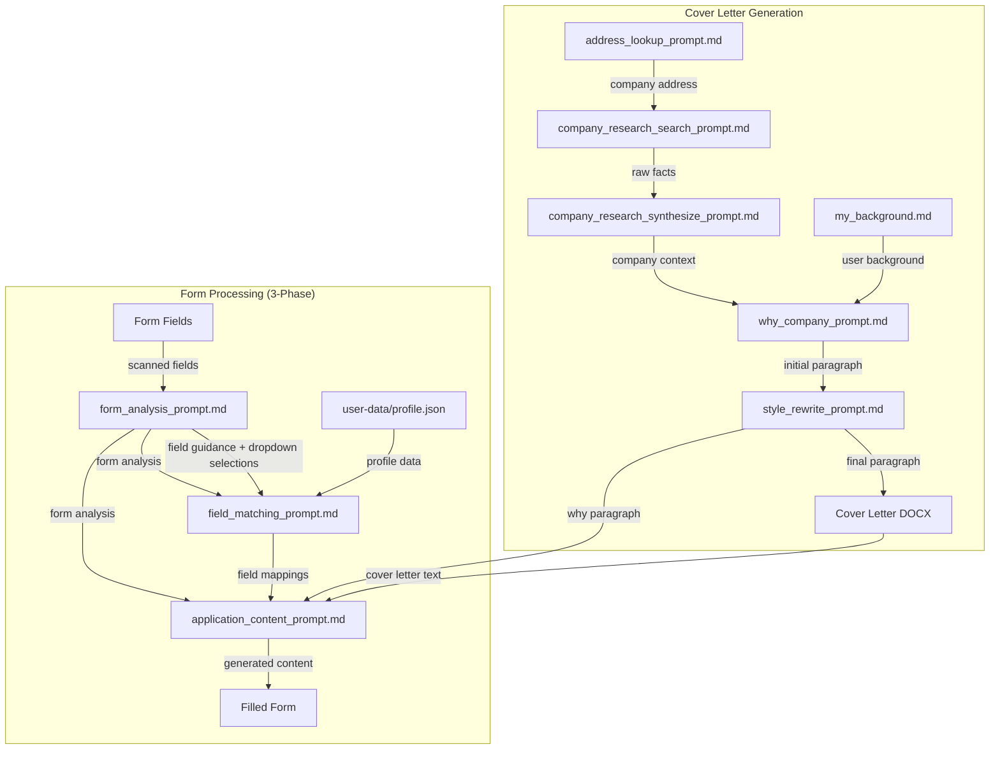

# Prompts Directory

This directory contains all prompt templates used by the job application tool for LLM interactions.

## Prompt Flow



## Prompt Inventory

| Prompt File | Purpose | Inputs | Outputs | Model |
|-------------|---------|--------|---------|-------|
| `address_lookup_prompt.md` | Find company headquarters or office address | `company_name`, `role_location_if_known` | `ADDRESS_LINE1`, `ADDRESS_LINE2` (structured text) | haiku |
| `company_research_search_prompt.md` | Gather raw facts about company (Phase 1) | `company_name`, `role_title` | Raw facts as bullet points | haiku |
| `company_research_synthesize_prompt.md` | Synthesize raw facts into context (Phase 2) | `company_name`, `role_title`, `raw_facts`, `job_description` | Structured company context (COMPANY_CONTEXT, ROLE_RELEVANCE, RECENT_NEWS) | sonnet |
| `why_company_prompt.md` | Generate "why I want to work here" paragraph | `company_name`, `role_title`, `company_context`, `my_background`, `job_description` | Cover letter paragraph (plain text) | sonnet |
| `style_rewrite_prompt.md` | Rewrite paragraph for style and clarity | `paragraph` | Rewritten paragraph (max 4 sentences, simplified) | haiku |
| `form_analysis_prompt.md` | Analyze form structure and provide guidance | `form_fields` (JSON with options for dropdowns/radios/checkboxes) | JSON with `field_guidance` and `dropdown_selections` | haiku |
| `field_matching_prompt.md` | Match form fields to values using analysis | `profile` (JSON), `form_analysis` (JSON) | JSON mapping: field ID → actual value or action string | haiku |
| `application_content_prompt.md` | Generate text content for fields | `cover_letter_text`, `why_paragraph`, `profile`, `fields_json`, `form_analysis` | JSON mapping: field ID → generated text | haiku |
| `my_background.md` | User's professional background (static context) | N/A (user-edited content) | Used as context input for `why_company_prompt.md` | N/A |

### Form Processing Flow

**Phase 1: Form Analysis** (`form_analysis_prompt.md`)
- Analyzes form holistically with dropdown/radio/checkbox options
- Returns `field_guidance` with actions and `dropdown_selections`

**Phase 2: Field Matching** (`field_matching_prompt.md`)
- Uses guidance to map fields to actual values or action strings
- Returns actual profile values or action types:
  - **`RESUME_UPLOAD`**: Resume/CV file upload fields
  - **`COVER_LETTER_FULL`**: Full cover letter with header
  - **`COVER_LETTER_BODY`**: Cover letter body without header
  - **`COVER_LETTER_WHY`**: Just the why-company paragraph
  - **`GENERATE_ANSWER`**: Generate contextual answer using profile and cover letter
  - **`ACKNOWLEDGE_TRUE`**: Checkboxes for agreements/acknowledgments
  - **`NEEDS_HUMAN`**: Cannot answer, requires human input
  - **`SKIP`**: Demographic/EEO fields user should review

**Phase 3: Content Generation** (`application_content_prompt.md`)
- Generates text content for fields marked with content actions
- Uses form analysis to avoid duplication across fields
- Has access to full cover letter, why paragraph only, and profile

## Model Configuration

Models are assigned to prompts in `config.json` under `task_models`:

```json
{
  "task_models": {
    "address_lookup": "haiku",
    "company_research_search": "haiku",
    "company_research_synthesize": "sonnet",
    "why_paragraph": "sonnet",
    "style_rewrite": "haiku",
    "form_analysis": "haiku",
    "field_matching": "haiku",
    "application_content": "haiku"
  }
}
```

- **Haiku**: Fast, cheap model for simple tasks (address lookup, style rewrite, form analysis, field matching, content generation, company research search)
- **Sonnet**: Balanced model for complex reasoning (company research synthesis, why paragraph generation)
- **Opus**: Best quality (currently unused, available for future use)

## Adding New Prompts

When adding a new prompt to the system:

### Checklist

- [ ] **Create prompt file**: Add `your_prompt_name.md` to `prompts/` directory
  - Use `{placeholder}` syntax for variable substitution
  - Include clear instructions for the LLM
  - Specify output format (JSON, plain text, structured text)

- [ ] **Update config.json**: Add entry to `task_models` section
  ```json
  "your_task_name": "haiku"  // or "sonnet" or "opus"
  ```

- [ ] **Update this README**:
  - Add node to Mermaid flowchart (if part of a pipeline)
  - Add row to prompt inventory table
  - Update special values section if applicable

- [ ] **Add code integration**:
  - In `generate_cover_letter.py` or `server.py`:
    - Use `load_prompt("your_prompt_name.md")`
    - Format with `.format(placeholder=value)`
    - Use `get_model_id("your_task_name")` to get model
    - Call Anthropic API with formatted prompt

- [ ] **Test the prompt**:
  - Verify placeholder substitution works
  - Check LLM response format matches expectations
  - Validate error handling for malformed responses

### Example: Adding a New Prompt

```python
# In server.py or generate_cover_letter.py

# 1. Load the prompt
prompt_template = load_prompt("your_prompt_name.md")

# 2. Format with variables
prompt = prompt_template.format(
    placeholder1=value1,
    placeholder2=value2
)

# 3. Get model from config
config, get_model_id = load_config()
model_id = get_model_id("your_task_name")

# 4. Call API
response = client.messages.create(
    model=model_id,
    max_tokens=500,
    messages=[{"role": "user", "content": prompt}]
)

# 5. Parse response
result = response.content[0].text
```

## Prompt Design Guidelines

### General Principles

1. **Be specific**: Clear, unambiguous instructions
2. **Define output format**: JSON, plain text, structured data
3. **Provide examples**: Show what good output looks like
4. **Use constraints**: Word limits, style rules, formatting requirements
5. **Handle edge cases**: What to do with missing data, ambiguous inputs

### Template Variables

Use Python `str.format()` syntax for placeholders:

```markdown
Your prompt text here with {variable_name}.

More context: {another_variable}
```

### Output Formats

**For JSON responses:**
```markdown
Return only valid JSON object, no explanation.
```

**For structured text:**
```markdown
Return in this format:
KEY1: value
KEY2: value
```

**For plain text:**
```markdown
Return a single paragraph of 3-5 sentences.
```

## Debugging Prompts

### View Prompt Before API Call

Most functions include debug output:

```python
# In generate_cover_letter.py
Path("debug_why_paragraph.txt").write_text(prompt, encoding="utf-8")
```

Check these files in the project root after running.

### Common Issues

**Problem**: LLM returns explanation instead of raw output
- **Fix**: Add "Return only [format], no explanation" to prompt

**Problem**: JSON parsing fails
- **Fix**: Use `json.loads(response.strip())` and handle JSONDecodeError

**Problem**: Missing placeholders
- **Fix**: Verify all `{placeholders}` are passed to `.format()`

**Problem**: Wrong model used
- **Fix**: Check `config.json` task_models mapping

## Maintenance

**This README should be updated when:**
- New prompts are added
- Prompt purposes change
- New special values are introduced
- Pipeline flows are modified
- Model assignments change

**Tracking prompt usage:**

To see which Python files use which prompts, run:
```bash
python scripts/prompt_usage.py
```

This generates `prompts/USAGE.md` with a complete usage map showing:
- Which prompts are currently in use
- Exact file locations and line numbers
- Unused prompts (if any)
- Orphaned references (prompts referenced but don't exist)

The usage report is automatically regenerated each time you run the script.

**Last updated**: 2026-01-15
